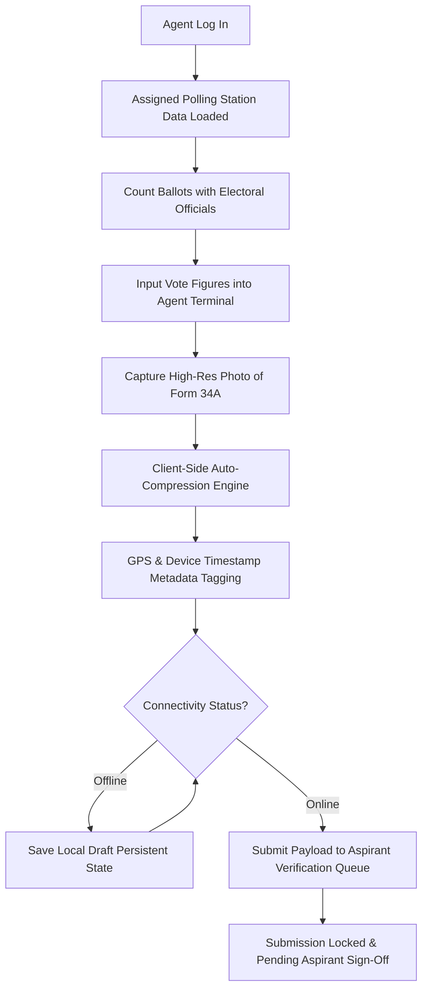

# 📱 Polling Station Agent Operations & Form 34A Workflow

This document details the operational protocol and technical workflow for **Polling Station Agents** utilizing the **Election Management System (EMS)**.

---

## 🎯 Overview

Polling Station Agents operate at the front line of election monitoring. Their primary task is to observe vote counting, take high-fidelity digital photographs of the official **Form 34A** (or local tally sheet), record vote figures for all contest levels (Presidential, Gubernatorial, Parliamentary, Civic), and transmit evidence to the campaign headquarters for verification.

---

## 🔄 Step-by-Step Agent Workflow

---

## 🛠️ Key Capabilities & Operational Features

### 1. Polling Station Identification & Context
- Upon selecting the **Agent** persona, the system automatically detects the agent's assigned polling station (e.g., *St. Andrew's Church Hall - PS #001*).
- System displays the administrative ward (*Westlands Ward*), constituency (*Westlands Constituency*), and total registered voters.

### 2. Form 34A Camera Evidence & Client-Side Compression
- Agents use their mobile device camera or photo upload button to capture the signed physical Form 34A carbon copy.
- **Client-Side Image Auto-Compression**:
  - High-res camera photos (typically 3.8 MB to 5 MB) are automatically re-encoded in browser memory.
  - Reduces payload size by **~89%** down to **~400 KB**, ensuring successful transmission even on weak 2G/3G cellular networks in remote locations.

### 3. Metadata & Cryptographic Tagging
Each submitted image is bound to security metadata:
- **GPS Coordinates**: e.g., `-1.2676, 36.8111` (verifies physical presence at the polling station).
- **Device Signature**: Identifies mobile browser terminal version.
- **Cryptographic Hash**: Generates a unique `0x...` hex hash signature to detect image tampering post-transmission.

### 4. Vote Tally Entry
Agents input counts for:
- **Presidential Election**: Candidate A, Candidate B, Candidate C, and Rejected/Spoiled votes.
- **Gubernatorial Election**: Johnson Sakaja, Polycarp Igathe, Rejected votes.
- **Parliamentary Election (MP)**: Tim Wanyonyi, Nelson Havi, Rejected votes.

### 5. Offline Draft Auto-Persistence
- Tally inputs and photo previews are continuously saved to `localStorage` key `ems_agent_draft_{agentId}`.
- If the phone reboots or connection drops mid-entry, all entered figures remain intact upon reopening the terminal.

---

## 📋 Best Practices for Field Agents

1. **Verify Official Signatures**: Ensure the Form 34A photo clearly shows signatures of all party agents and the Presiding Officer.
2. **Check Image Clarity**: Ensure the serial numbers and handwritten numbers on Form 34A are legible before hitting **Submit**.
3. **Draft Regularly**: Tap **Save Draft** if ballot counting takes place in stages across different contest levels.
