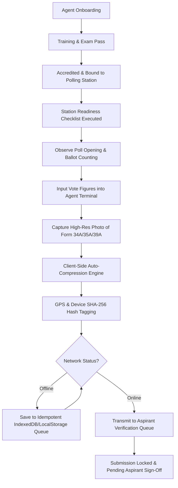

# 📱 Polling Station Agent Operations, Accreditation & Form 34A Workflow

This document details the operational protocol, accreditation lifecycle, mission center, and technical workflow for **Polling Station Agents** utilizing the **Election Management System (CI-EMS 3.1)**.

---

## 🎯 Overview

Polling Station Agents operate at the front line of election monitoring. Their primary responsibilities include:
1. Completing agent training and statutory accreditation exams.
2. Executing pre-election voter outreach and station readiness missions.
3. Monitoring polling station opening, voter queue progression, and ballot counting.
4. Capturing high-fidelity digital photographs of official statutory result forms (e.g. **Form 34A**, **Form 35A**, **Form 39A**).
5. Recording vote figures across all contest levels (Presidential, Gubernatorial, Parliamentary, Civic).
6. Transmitting evidence and tally payloads securely to campaign headquarters for verification.

---

## 🔄 Step-by-Step Agent Operations Lifecycle

---

## 🎓 1. Agent Accreditation & Certification (`agentCertification.js`)

Before deployment on election day, every agent must progress through the 5-stage accreditation lifecycle:

| Status Code | Stage Name | Requirement for Progression |
| :--- | :--- | :--- |
| `UNASSIGNED` | Registered Candidate Agent | Profile created and assigned to constituency pool. |
| `TRAINING_COMPLETED` | Training Completed | Passed election law & statutory form handling course. |
| `EXAM_PASSED` | Exam Certified | Scored $\ge 85\%$ on statutory form verification exam. |
| `ACCREDITED` | IEBC Badged | Issued official Electoral Commission accreditation card & PIN. |
| `DEPLOYED_AT_STATION` | Deployed | Checked in at assigned polling station with GPS lock. |

---

## 📋 2. Station Readiness Checklist & Logistics

Upon arriving at the assigned polling station on election morning (05:30 AM), the agent completes the **Station Readiness Checklist**:
- [x] **IEBC Accreditation Badge**: Visible on lanyard.
- [x] **Battery Power Status**: Terminal charged to $\ge 80\%$ + power bank connected.
- [x] **Statutory Tally Sheets**: Carbon copy sheets for Form 34A/35A/39A ready.
- [x] **Presiding Officer Contact**: Presider name & phone number logged into terminal.
- [x] **Network Connectivity**: Signal check logged (2G/3G/4G/WiFi).

---

## 🎯 3. Agent Mission Center (`agentMissions.js`)

Agents execute structured mission vectors throughout the election cycle:

1. **Pre-Election Phase**:
   - `MISSION_STATION_GEOGRAPHY_CHECK`: Verify physical polling station location & GPS coordinates.
   - `MISSION_STAKEHOLDER_ENGAGEMENT`: Log meetings with local village elders & mobilizers.
2. **Election Day Phase**:
   - `MISSION_POLL_OPENING_AUDIT`: Confirm ballot box seal numbers and poll opening time (06:00 AM).
   - `MISSION_HOURLY_TURNOUT_REPORT`: Submit turnout counts at 09:00, 12:00, 15:00, and 17:00.
   - `MISSION_INCIDENT_ESCALATION`: Log voter intimidation, equipment failure, or missing materials.
   - `MISSION_FORM_34A_CAPTURE`: Capture signed statutory form, enter figures, and transmit payload.

---

## 📸 4. Form 34A Evidence Capture & Compression Engine

- Agents capture physical Form 34A carbon copies using their mobile camera terminal.
- **Browser-Memory Auto-Compression**:
  - High-res photos (3.8 MB to 5.0 MB) are automatically re-encoded in browser memory.
  - Reduces payload size by **~89%** down to **~400 KB**, allowing instant delivery over congested cellular networks.
- **Cryptographic & Hardware Tagging**:
  - SHA-256 binary hash signature calculated in browser.
  - GPS coordinates (e.g. `-1.2676, 36.8111`) and hardware fingerprint attached.

---

## 🔄 5. Offline Resiliency & Break-Glass Recovery Protocol

### Idempotent Offline Sync
- If network connection is disrupted during tally submission, the payload is persisted into the offline sync queue (`IndexedDB` / `localStorage`).
- Automatically flushes upon network restoration using an `idempotency_key` (`UUIDv4`) to guarantee exactly-once processing.

### Break-Glass Device Recovery (`deviceRecovery.js`)
If an agent's phone is lost, stolen, or damaged:
1. Station Coordinator triggers **Break-Glass Device Recovery**.
2. Old terminal device signature is revoked immediately (`DEV_STATUS: REVOKED`).
3. Replacement device is provisioned with a temporary emergency token.
4. Audit ledger logs device transition (`DEVICE_BREAK_GLASS_RECOVERY`) without breaking audit continuity.

---

## 📋 Best Practices for Field Agents

1. **Verify Official Signatures**: Ensure the Form 34A photo clearly shows signatures of all party agents and the Presiding Officer.
2. **Check Image Clarity**: Ensure serial numbers and handwritten totals are sharp and legible before tapping **Submit**.
3. **Draft Regularly**: Save draft tallies continuously during counting across Presidential, Gubernatorial, MP, and MCA levels.
