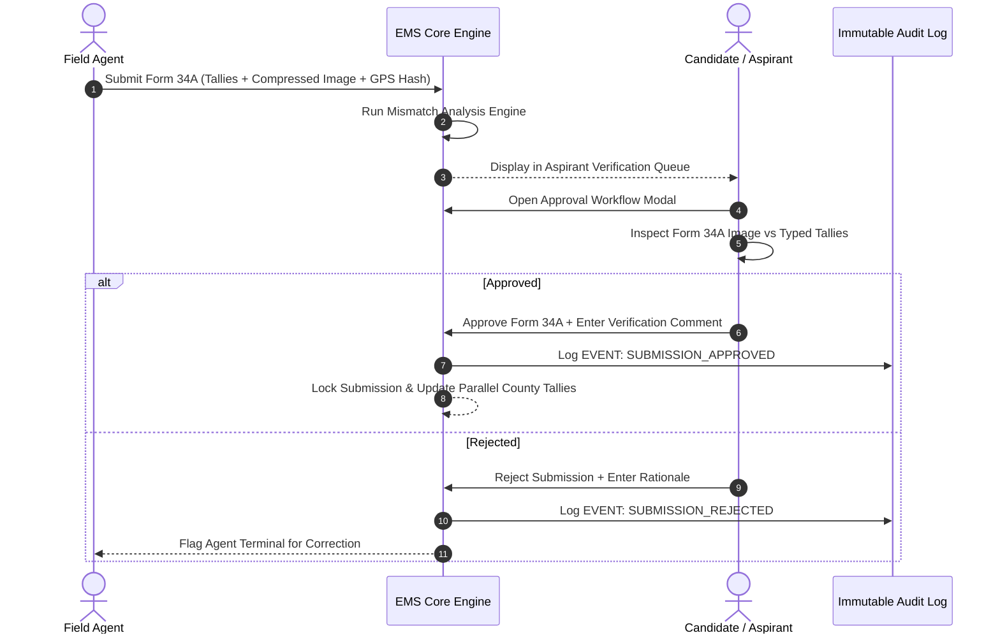

# 🛡️ Aspirant & Candidate Approval Workflow

This document outlines the verification and sign-off procedure for **Aspirants**, **Candidates**, and **Campaign Managers** in the **Election Management System (EMS)**.

---

## 🎯 Purpose

Before any agent-submitted polling station tally is incorporated into the official parallel vote total, it must pass through the **Aspirant Verification Queue**. This ensures that human oversight inspects every Form 34A evidence photo against the handwritten tally numbers to catch typing errors, rogue agent submissions, or deliberate tampering.

---

## 🔄 Verification & Approval Architecture

---

## 🖥️ Operational Steps for Aspirants & Campaign Auditors

### 1. Navigating the Verification Queue
- Log into EMS under an **Aspirant** persona (e.g., *Johnson Sakaja*, *Tim Wanyonyi*, or *Polycarp Igathe*).
- The dashboard highlights **Pending Approvals**, **Approved Form 34As**, and **Flagged Mismatches**.

### 2. Inspecting Evidence in the Modal
Clicking **Review & Verify** opens the `ApprovalWorkflowModal`:
- **Side-by-Side View**:
  - **Left Panel**: Form 34A evidence photo preview, GPS location, device terminal ID, and cryptographic hash.
  - **Right Panel**: Typed vote counts (Presidential, Gubernatorial, Parliamentary) side-by-side.

### 3. Executing Approval Decision
- **Approve**: If figures match the physical image, click **Approve Form 34A**.
  - Status updates to `Approved`.
  - Figures are locked and indexed into county-wide totals.
  - Action is written to `ems_audit_logs`.
- **Reject**: If an error is spotted (e.g. agent mistyped candidate numbers), click **Reject Submission**.
  - Enter rationale (e.g., *"Agent inverted Candidate A and Candidate B tallies"*).
  - Status updates to `Rejected`.
  - Notification sent to agent to resubmit corrected data.

---

## 📊 Summary Metrics Tracked

- **Total Polling Stations Assigned**: e.g., 3,978 stations.
- **Form 34As Verified**: Verified count and percentage of total boundary.
- **Pending Sign-offs**: Actionable queue indicator.
- **Flagged Discrepancies**: Items marked with status `Mismatch` for legal follow-up.
